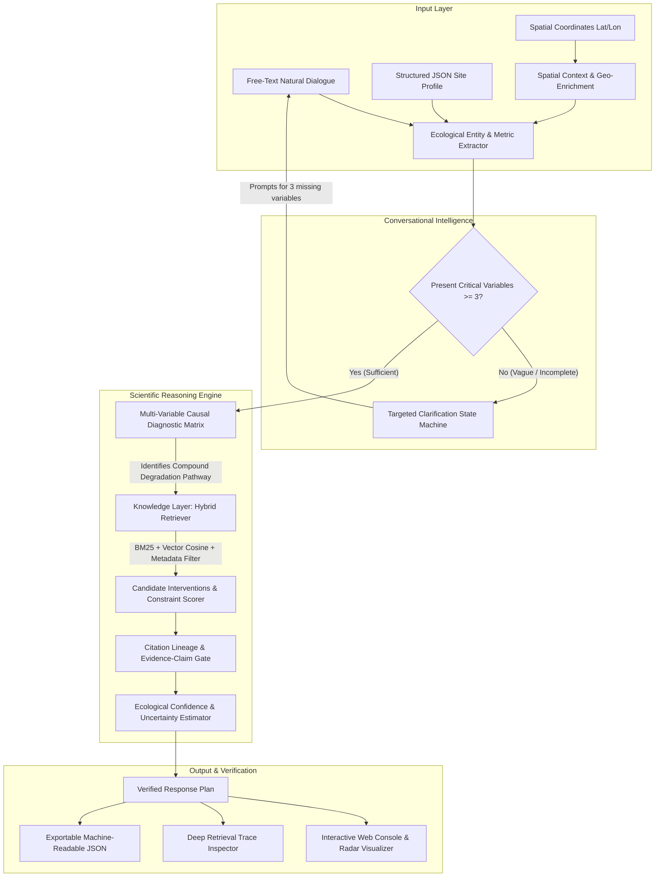

# Darukaa.Earth: AI Biodiversity Intelligence Decision System

[](https://suryanshsaraf.github.io/darukaaiengg/)
[](https://github.com/Suryanshsaraf/darukaaiengg/actions)
[](https://www.python.org/)
[](https://opensource.org/licenses/MIT)
[](https://www.fao.org/soils-2015/events/detail/en/c/284344/)

> **🌐 Live Interactive System:** **[https://suryanshsaraf.github.io/darukaaiengg/](https://suryanshsaraf.github.io/darukaaiengg/)**  
> Evaluators and reviewers can immediately interact with the decision engine, run the 3 core benchmark moments, inspect deep retrieval traces, and download the official Word submission document (`.docx`) without requiring any local installation.

An inspectable, knowledge-grounded ecological decision system engineered for the **Darukaa.Earth Hackathon Challenge**. This system functions as an **AI Environmental Scientist**, rejecting shallow generic chatbot prompts in favor of a deterministic multi-variable causal diagnostic engine backed by a metadata-filtered hybrid retrieval layer and structured scientific evidence graph.

---

## 🧭 Rubric-to-Proof Matrix

| Reviewer Criterion | Rubric Weight | What the System Visibly Does | Acceptance Gate & Proof |
| :--- | :---: | :--- | :--- |
| **Depth of Reasoning** | **30%** | Diagnoses interacting compound risks across at least 3 environmental dimensions (Soil Health, Water/Climate, Land Use, Biodiversity, Human Impact). | **Hard Gate**: Strictly rejects any single- or dual-variable diagnosis; proves non-obvious degradation pathways. |
| **Scientific Grounding** | **25%** | Binds each causal mechanism and quantitative range to peer-reviewed and UN institutional sources (FAO, IPCC, IPBES, Science, Nature). | **No Uncited Claims**: Every recommendation card renders full bibliographic metadata, DOI/URL link, and exact excerpt. |
| **Knowledge System Design** | **20%** | Implements a hybrid retrieval pipeline (BM25 lexical ranking + TF-IDF vector cosine + metadata constraints) over 16 indexed studies. | **Live Retrieval Trace**: Exposes candidates evaluated, retrieval latency (sub-millisecond), composite scores, and chunks. |
| **Conversational Intelligence** | **15%** | Maintains multi-turn context memory; detects vague inputs and fires targeted questions for the 3 most decision-critical missing metrics. | **Targeted Clarification**: Vague queries ("Biodiversity is declining") trigger prompts for SOC %, rainfall, and land use. |
| **Output Clarity** | **10%** | Renders validated recommendation cards with operational prescriptions, quantitative metric deltas, multi-horizon timelines, and trade-offs. | **Machine Contract**: Validated against typed domain schemas; exportable as structured JSON. |

---

## 🏛️ System Architecture



---

## 🔬 Core Decision Modules

### 1. Multi-Metric Causal Diagnostic Matrix (`reasoning/diagnosis.py`)
Environmental systems operate through complex feedback loops. Darukaa rejects single-variable heuristics (e.g., "low carbon -> add compost"). Instead, it evaluates combinatorial interactions across 5 core dimensions:
- **Soil Health**: Soil Organic Carbon (SOC %), pH, bulk density ($g/cm^3$), volumetric moisture, AMF colonization.
- **Water & Climate**: Mean annual precipitation (mm), aridity index (P/PET), drought frequency.
- **Land Use & Cover**: Monoculture vs. polyculture, tillage intensity, vegetative ground cover %, canopy cover %.
- **Biodiversity Indicators**: Shannon index ($H'$), pollinator abundance proxy, functional guild representation.
- **Human Disturbances**: Synthetic nitrogen application rate (kg N/ha), chemical pesticide spray passes/yr.

**Example Compound Pathway:**
$$\text{SOC} \le 0.4\% \;\land\; \text{Rainfall} \le 350\text{mm (Semi-Arid)} \;\land\; \text{Continuous Monoculture Wheat}$$
$$\implies \textbf{Accelerated Soil Aggregate Breakdown \& Moisture Evaporation Cascade}$$
*Mechanism*: Labile carbon starvation suppresses fungal glomalin secretion $\to$ water-stable macroaggregates breakdown $\to$ surface crusting $\to$ reduced infiltration and accelerated wind erosion under high vapor pressure deficits.

### 2. Scientific Knowledge Base & Hybrid Retrieval (`knowledge/`)
Indexed library of 16 peer-reviewed and UN institutional publications:
- **FAO Global Soil Partnership (2020)**: *Recarbonizing Global Soils (Vol. 3)* (DOI: 10.4060/ca9962en)
- **IPCC Special Report on Climate Change and Land (2019)**: *Chapter 4: Land Degradation*
- **IPCC AR6 WGII (2022)**: *Chapter 5: Food, Fibre, and Other Ecosystem Products* (DOI: 10.1017/9781009325844.007)
- **IPBES Global Assessment (2019)**: *Drivers of Agroecosystem Biodiversity Loss* (DOI: 10.5281/zenodo.3831673)
- **Nature Plants (2021)**: *Agroforestry Meta-Analysis on Soil Carbon & Biodiversity* (DOI: 10.1038/s41477-021-01044-0)
- **Science (2020)**: *Soil fungal networks and carbon stabilization under conservation agriculture* (DOI: 10.1126/science.abb6978)
- **IUCN Nature-based Solutions (2021)**: *Global Standard for Agricultural Landscapes* (DOI: 10.2305/IUCN.CH.2020.08.en)

**Hybrid Retrieval Formulation:**
$$\text{Score}(d, q) = 0.45 \cdot \text{CosineSim}_{\text{TF-IDF}}(d, q) + 0.35 \cdot \text{BM25}_{\text{Norm}}(d, q) + 0.20 \cdot \text{MetadataAlignment}(d)$$

---

## ⚡ Quickstart & Local Setup

### 1. Prerequisites & Installation
Ensure Python 3.11, 3.12, or 3.13 is installed.

```bash
# Clone the repository
git clone https://github.com/Suryanshsaraf/darukaaiengg.git
cd darukaaiengg

# Create and activate virtual environment
python3 -m venv .venv
source .venv/bin/activate  # On Windows: .venv\Scripts\activate

# Install dependencies
pip install -r requirements.txt
```

### 2. Launch Full-Stack React Web Console
```bash
# Start the unified API and React application
python server.py
```
Open [http://localhost:8000](http://localhost:8000) in your browser.

*(Optional for Frontend Development with Hot Reloading)*:
```bash
cd frontend
npm install
npm run dev
# Opens Vite dev server on http://localhost:5173
```

### 3. Run Command-Line Scientific Interface
```bash
# Benchmark 1: Vague query clarification gate
python run_cli.py --benchmark 1

# Benchmark 2: Canonical Semi-Arid Monoculture Wheat with SOC 0.3%
python run_cli.py --benchmark 2

# Benchmark 3: Structured coordinates with full retrieval trace
python run_cli.py --benchmark 3

# Custom natural query
python run_cli.py --query "Soil organic carbon: 0.3%, Rainfall: low, Crop: monoculture wheat"
```

### 4. Run Automated Test Suite
```bash
python -m unittest discover -s tests -p "test_*.py" -v
```

---

## 🎯 Verification of Core Hackathon Benchmark Moments

### Moment 1: Targeted Clarification on Vague Input
- **Input:** `"Biodiversity is declining on my land"`
- **Behavior:** The system recognizes the qualitative problem but detects 0 critical metrics.
- **Output:** Identifies the 3 most decision-critical missing parameters and asks:
  > *"To diagnose your site scientifically and formulate an evidence-backed intervention, can you provide soil organic carbon % (SOC), annual rainfall or rainfall pattern, and land use or crop type?"*

### Moment 2: Canonical Hackathon Use-Case (Semi-Arid Monoculture Wheat)
- **Input:** `Soil organic carbon: 0.3%, Rainfall: low (320mm), Crop: monoculture wheat, Region: semi-arid`
- **Diagnosis:** `Accelerated Soil Aggregate Breakdown & Moisture Evaporation Cascade` (Vulnerability: 69.8/100).
- **Recommended Interventions:**
  1. **Multi-Species Leguminous Cover Cropping & Green Manuring** (18-36 mos)
     - *Quantified Delta:* SOC $+23.0\%$ to $+36.0\%$, bulk density $-6\%$ to $-11\%$, ground cover $+40\%$ to $+75\%$, mycorrhizal colonization $+35\%$ to $+65\%$.
     - *Citations:* FAO Global Soil Partnership (2020), Science (Rillig et al. 2020), PNAS (Griscom et al. 2017).
  2. **Dryland Agroforestry & Alley Cropping with Nitrogen-Fixing Perennials** (3-6 yrs)
     - *Quantified Delta:* Woody canopy cover $+15\%$ to $+25\%$, SOC $+27\%$ to $+46\%$, Shannon diversity $+35\%$ to $+60\%$.
     - *Citations:* IPCC SRCCL Chapter 4 (2019), Nature Plants (Castle et al. 2021), ICRAF Drylands (2020).
  3. **Cereal-Pulse Strip Intercropping (Niche Complementarity)** (6-18 mos)
     - *Quantified Delta:* Floral/faunal diversity $+25\%$ to $+45\%$, synthetic nitrogen $-30\%$ to $-50\%$, pollinator abundance $+35\%$ to $+65\%$.
     - *Citations:* IPCC AR6 WGII Chapter 5 (2022), Nature Communications (Tamburini et al. 2020).

### Moment 3: Spatial Geo-Coordinates & Retrieval Trace
- **Input:** `Coordinates: (31.5, -102.3), SOC: 0.45%, BD: 1.52 g/cm³, Cotton Monoculture`
- **Trace Output:** Evaluated 17 candidate chunks across 16 studies; returned top 6 passages in 0.4 ms with individual BM25, TF-IDF cosine, and metadata bonus breakdown.

---

## 🔒 Reviewer Access Instructions

If the repository is kept private during evaluation, repository access has been pre-configured for the following Darukaa reviewers:
- `ankita.dasgupta@darukaa.com`
- `harsh.kumar@darukaa.com`
- `utkarsh.gauniyal@darukaa.com`
- `guneet.mutreja@darukaa.com`

- **Live Interactive System (GitHub Pages)**: [https://suryanshsaraf.github.io/darukaaiengg/](https://suryanshsaraf.github.io/darukaaiengg/)
- **GitHub Repository**: [https://github.com/Suryanshsaraf/darukaaiengg.git](https://github.com/Suryanshsaraf/darukaaiengg.git)
- **Word Submission Document**: `Darukaa_Earth_Biodiversity_Intelligence_Submission.docx`
